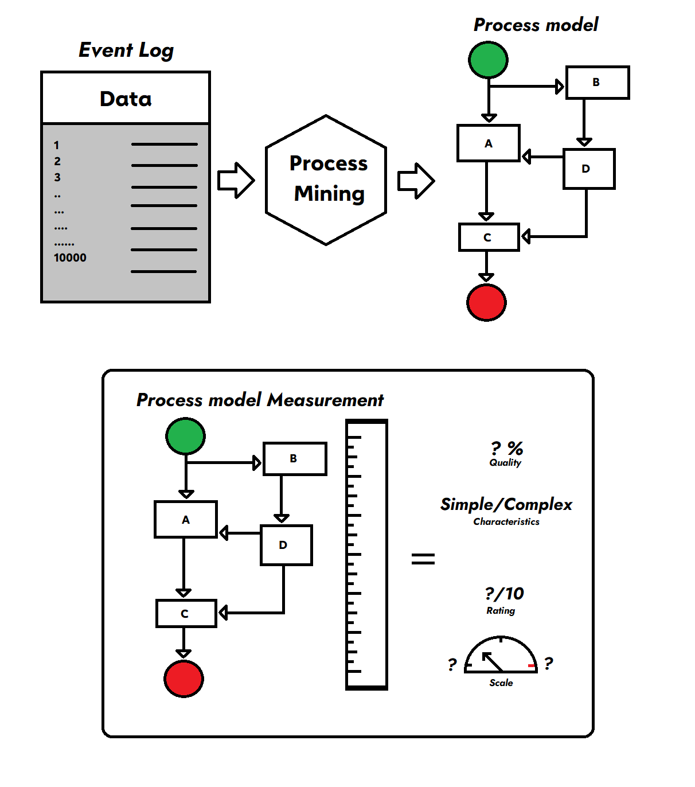
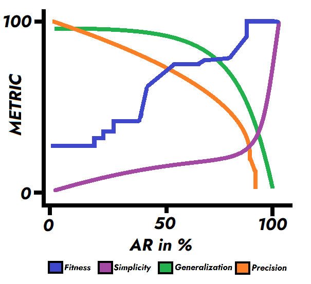

# The QUAD Metrics for Process Modelling

This Repository houses the QUAD metrics adapted for process modelling toolkit ProFIT.

The Metrics are: 

  1. **Replay Fitness**
  2. **Precision**
  3. **Generalization**
  4. **Simplicity**

By evaluating a Process model with these metrics, we can  obtain a balanced perspective on the Complexity & Understandability of the model. 

You can refer to the publications: 
An Experimental Outlook on Quality Metrics for Process Modelling: A Systematic Review and Meta Analysis (https://www.mdpi.com/1999-4893/16/6/295)

These Metrics are ready to use & are configured to run in Regime 1 & Regime 2 (Provided in the documentation).

On simulating these Metrics, a combined numeric graph can be generated as follows: 

A link to ProFIT: https://github.com/itmo-escience/ProFIT

Currently, these metrics are in the .IPYNB format, they are being ported into Library-style files & will be uploaded in this repository (~August 2023)

For any queries, feel free to send an email: ashish.ts.ireddy@yandex.ru
